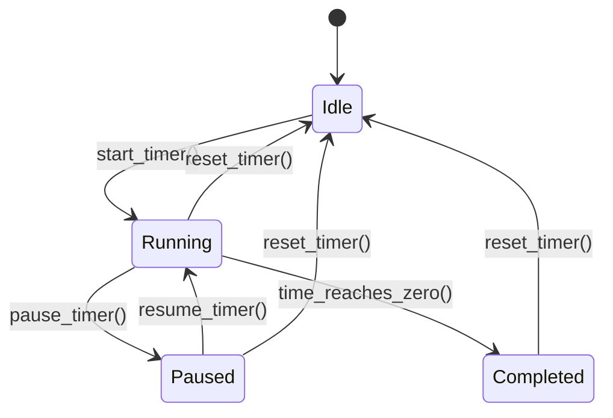

# Design Document

## Overview

The Rust Slint Timer is a desktop application that provides countdown timer functionality with a modern, responsive user interface. The application will be built using Rust for the backend logic and Slint for the UI framework, leveraging Slint's declarative UI approach and Rust's performance and safety features.

## Architecture

The application follows a Model-View-Controller (MVC) pattern adapted for Slint's architecture:

- **Model**: Rust structs managing timer state, validation, and business logic
- **View**: Slint UI components defined in `.slint` files
- **Controller**: Rust code that bridges the model and view, handling user interactions and timer updates

### Component Structure

```
src/
├── main.rs              # Application entry point and Slint integration
├── timer/
│   ├── mod.rs          # Timer module exports
│   ├── state.rs        # Timer state management
│   └── logic.rs        # Timer business logic and validation
└── ui/
    └── timer.slint     # Slint UI definition
```

## Components and Interfaces

### Timer State Component (`timer/state.rs`)

```rust
#[derive(Debug, Clone)]
pub struct TimerState {
    pub hours: u32,
    pub minutes: u32,
    pub seconds: u32,
    pub remaining_seconds: u32,
    pub is_running: bool,
    pub is_completed: bool,
}
```

**Responsibilities:**
- Store current timer configuration and state
- Track remaining time during countdown
- Manage timer status (running, paused, completed)

### Timer Logic Component (`timer/logic.rs`)

```rust
pub struct TimerLogic {
    state: TimerState,
    callback: Option<Box<dyn Fn(TimerState)>>,
}
```

**Key Methods:**
- `validate_time(hours, minutes, seconds) -> Result<(), String>`
- `start_timer()`
- `pause_timer()`
- `reset_timer()`
- `tick()` - Called every second to update countdown
- `set_state_callback()` - Register UI update callback

### Slint UI Interface (`ui/timer.slint`)

**Main Components:**
- Time input fields (hours, minutes, seconds)
- Display area showing current countdown
- Control buttons (Start/Pause, Reset)
- Status indicators and completion notifications

**Properties and Callbacks:**
```slint
export component TimerWindow inherits Window {
    in-out property <int> input-hours;
    in-out property <int> input-minutes;
    in-out property <int> input-seconds;
    in-out property <string> display-time;
    in-out property <bool> is-running;
    in-out property <bool> is-completed;
    
    callback start-pause-clicked();
    callback reset-clicked();
    callback time-input-changed(int, int, int);
}
```

## Data Models

### TimerState Data Flow

1. **Input Phase**: User enters time values → Validation → Store in TimerState
2. **Running Phase**: Timer ticks every second → Update remaining_seconds → Notify UI
3. **Completion Phase**: remaining_seconds reaches 0 → Set is_completed → Trigger notifications

### State Transitions



## Error Handling

### Input Validation Errors
- **Invalid Range**: Hours > 23, Minutes/Seconds > 59
- **Negative Values**: Any negative input
- **Non-numeric Input**: Handle parsing errors gracefully

**Strategy**: Display inline error messages, prevent timer start until valid

### Runtime Errors
- **Timer Thread Panics**: Implement error recovery and state reset
- **UI Update Failures**: Log errors, attempt to refresh UI state

**Strategy**: Graceful degradation with user notification

### Resource Management
- **Memory Leaks**: Proper cleanup of timer threads and callbacks
- **CPU Usage**: Efficient timer implementation using system timers

## Testing Strategy

### Unit Tests
- **Timer Logic**: Test all state transitions and edge cases
- **Validation**: Test input validation with boundary values
- **Time Calculations**: Test countdown accuracy and completion detection

### Integration Tests
- **UI-Logic Integration**: Test callback mechanisms between Slint and Rust
- **Timer Accuracy**: Test actual timing precision over various durations
- **State Synchronization**: Ensure UI reflects model state correctly

### Manual Testing Scenarios
- **User Workflows**: Complete timer cycles with various time inputs
- **Edge Cases**: Zero time input, maximum time values, rapid start/stop
- **UI Responsiveness**: Window resizing, focus management, accessibility

### Test Data
- **Valid Inputs**: (1,30,45), (0,5,0), (2,0,0)
- **Invalid Inputs**: (-1,0,0), (25,0,0), (0,60,0), (0,0,60)
- **Edge Cases**: (0,0,0), (23,59,59), (0,0,1)

## Implementation Notes

### Slint Integration
- Use `slint::Timer` for accurate timing
- Implement proper callback handling between Rust and Slint
- Leverage Slint's property binding for reactive UI updates

### Performance Considerations
- Timer updates limited to 1Hz (once per second)
- Efficient string formatting for time display
- Minimal UI redraws by updating only changed properties

### Platform Compatibility
- Target desktop platforms (Windows, macOS, Linux)
- Use Slint's native rendering for platform-appropriate look and feel
- Handle platform-specific timer precision differences